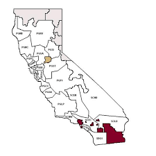
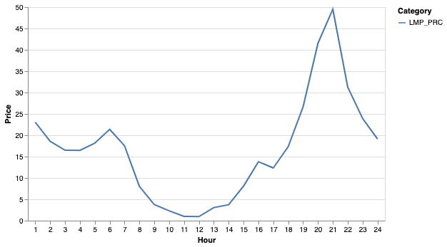

# CAISO Oasis Data Extraction

The California Independent System Operator's ("CAISO") electricity market is divided into 27 sub-Load Aggregation Point ("subLAP") zones as shown in the Figure below. Due to the transmission contraints across the boundaries, each zone has a unique energy price. This project extracts and aggregates the energy prices for selected zone and year of choice via CAISO's Oasis api.

**California SubLAP zone map**



The Sub-LAPs are spread across the 4 utility regions, as shown in the table below:
- Pacific Gas and Electric, 
- Southern California Edison;
- San Diego Gas and Electric Company; and
- Valley Electric Association 

| SubLAP                      | Node Name                                                                                                                                             |
|-----------------------------|-------------------------------------------------------------------------------------------------------------------------------------------------------|
| Pacific Gas & Electric      | 'PGCC', 'PGEB', 'PGF1', 'PGFG', 'PGHB', 'PGKN', 'PGLP', 'PGNB', 'PGNC', 'PGNP','PGNV', 'PGP2', 'PGSA', 'PGSB', 'PGSF', 'PGSI', 'PGSN', 'PGST', 'PGZP' |
| Southern California Edison  | 'SCEC', 'SCEN', 'SCEW', 'SCHD', 'SCLD', 'SCNW'                                                                                                        |
| San Diego Gas & Electric    | 'SDG1'                                                                                                                                                |
| Valley Electric Association | 'VEA'                                                                                                                                                 |

## Tools

1. **Hourly Price Extractor**

```
extract_hourly_data(year, nodes):
"""
Downloads and aggregates hourly energy prices for selected California Sub-LAPs a year of choice

Parameters:
year:  str

Outputs:
pandas.DataFrame

Example:
extract_hourly_data(2017, ['VEA'])

"""
```

2. **5-minute Price Extractor**

```
extract_5min_data(year, node):
"""
Downloads Southern California 5-minute energy prices from CAISO's Oasis Portal for a year of choice
and aggregates separate files into a single csv file

Parameters:
year:  str

Outputs:
pandas.DataFrame

Example:
extract_hourly_data(2017, 'SDG1')

"""
```

## Output

The raw downloaded csv files contain the following fields:

- **INTERVALSTARTTIME_GMT** - *GMT Start Time*
- **INTERVALENDTIME_GMT** - *GMT End Time*
- **OPR_DT** - *Operating Date*
- **OPR_HR**  - *Operating Hour*
- **OPR_INTERVAL** - *Operating Interval*
- **NODE_ID_XML** - *Node*
- **NODE_ID** - *same as above*
- **NODE** - *same as above*
- **MARKET_RUN_ID** - *Market* 
- **LMP_TYPE** - *Locational Marginal Price Type*
- **XML_DATA_ITEM** - *Price Category*
- **PNODE_RESMRID** - *Node*
- **GRP_TYPE** -  *Unused*
- **POS** - *Unused*
- **MW** - *Price*
- **GROUP** - *Group*

The following chart was created using data from June 1st, 2019.


